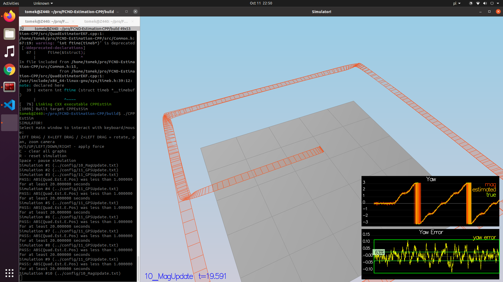

### Step 1: Sensor Noise ###

- I calculated the std dev of GPS and accelerometer (see notebook [calculate_stdev.ipynb]() )
- I plugged the resulting std devs into `config/6_Sensornoise.txt`.
- Standard deviations are ~68%

Result:

### Step 2: Attitude Estimation ###

- I implemented `UpdateFromIMU()` function based on Section 7.1.2 of Estimation for Quadrotors](https://www.overleaf.com/read/vymfngphcccj).
- My attitude estimator passed the tests.

Result:

### Step 3: Prediction Step ###

- I implemented `PredictState()`, `GetRbgPrime()` and `Predict()` functions based on Estimation for Quadrotors](https://www.overleaf.com/read/vymfngphcccj).
- The implementation passes the tests
- The sigmas look good feasible (see image below)

Result:

### Step 4: Magnetometer Update ###

- I implemented `UpdateFromMag()` function
- I had to increase `QYawStd` value in `QuadEstimatorEKF.txt` from 0.05 to 0.1
- The quadcopter passes the test

### Step 5: Closed Loop + GPS Update ###

- Implemented `UpdateFromGPS()`.
- Switched off ideal estimator 
- Switched on realistic IMU

### Step 6: Adding Your Controller ###

- Replaced the estimator with my own 
- Tuned parameters

Results on Scenario 11:

